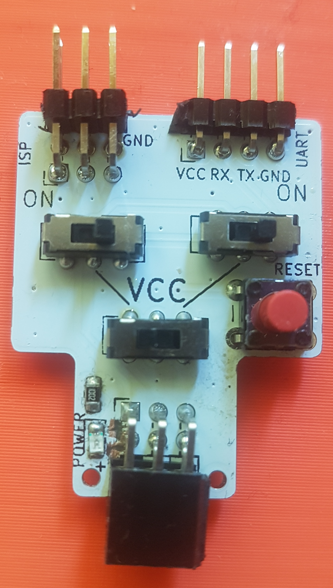
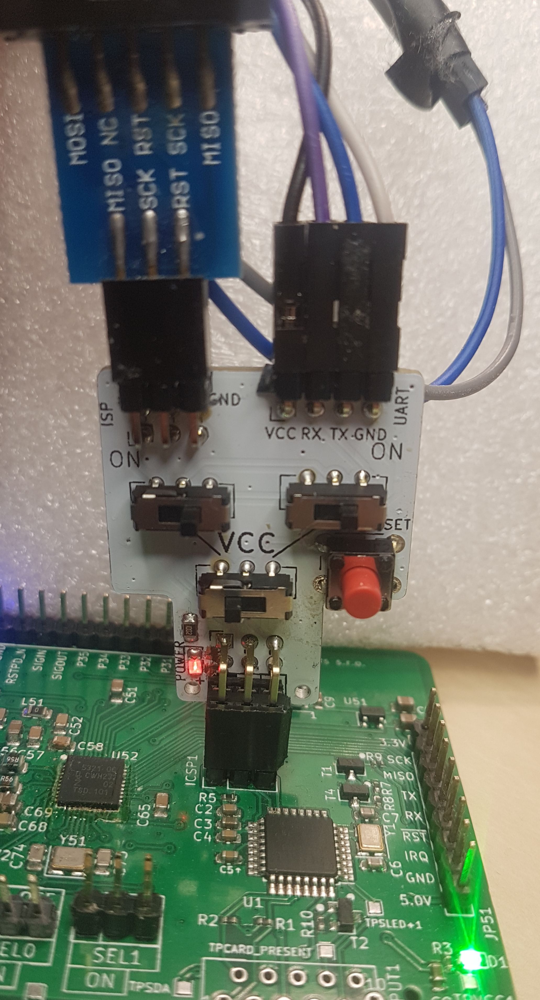
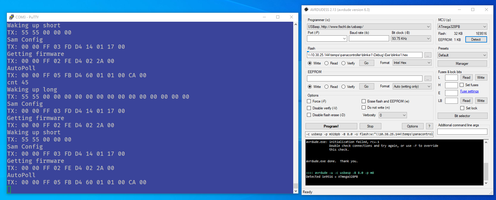

# ISPBreakout
ATmega328PB ICSP/UART breakout

## Description
ATmega328PB has a second UART port that is sharing pins with ICSP/SPI. While this can be handy for debugging you may need to swap ICSP and UART dongles. This breakout board features:
* ICSP in connector, UART in connector
* ICSP out connector
* switches that enables/disables the shared pins in ICSP and UART ports
* switch to choose if the device should be powered from ICSP or UART
* reset button for the ATmega328PB
* (Optional) Power LED

## Assembly

This PCB is designed to be beginner friendly. All you need to populate are the through hole switches and 2.54mm headers. The button and SMD LED (0805) are optional - a great way to start with SMD components.

### Parts
* 3x DPDT On-On 2.54mm pitch switch - i.e. https://lcsc.com/product-detail/Toggle-Switches_Korean-Hroparts-Elec-K3-2235D-F1_C189615.html
* 1x 2x3 2.54 female pin header (angled)
* 1x 2x3 2.54 male pin header (angled)
* 1x 1x4 2.54 male pin header (angled)
* (optional) 1x 6mm tactile switch - i.e. https://lcsc.com/product-detail/Tactile-Switches_ALPSALPINE-SKHHBYA010_C139760.html
* (optional) 1x 0805 SMD LED 
* (optional) 1x 0805 10K SMD resistor

## Demo

